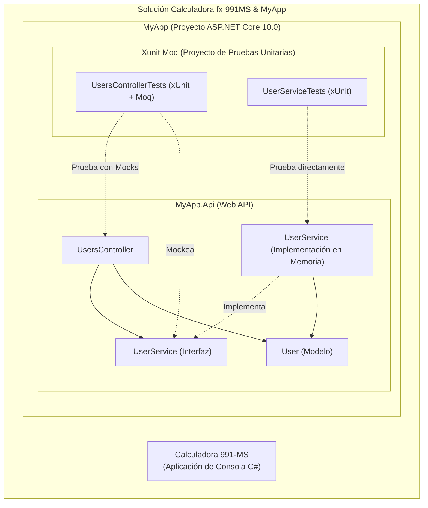
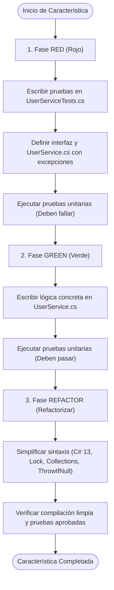

# Simulador Calculadora Casio fx-991MS & API de Gestión de Usuarios

Este repositorio contiene dos proyectos desarrollados en **C# 13 y .NET 10**:
1. **Simulador de Calculadora Científica fx-991MS:** Una aplicación de consola interactiva en C# que replica todas las funciones matemáticas y trigonométricas de una calculadora Casio fx-991MS.
2. **MyApp (Web API & Pruebas Unitarias TDD):** Una API REST para la gestión de usuarios diseñada bajo los principios de Desarrollo Guiado por Pruebas (TDD), con una cobertura de pruebas unitarias del **100%** utilizando **xUnit** y **Moq**, integrada con análisis estático en **SonarQube Cloud** y pipelines CI/CD de **GitHub Actions**.

---

## Arquitectura de la Solución

La solución consta de dos proyectos independientes estructurados de la siguiente forma:



---

## Flujo de Desarrollo Guiado por Pruebas (TDD)

El servicio `UserService` y su suite de pruebas se desarrollaron siguiendo rigurosamente el ciclo de TDD (**Red-Green-Refactor**):



1. **Fase RED:** Escribimos primero el contrato de interfaz `IUserService` y las pruebas de comportamiento en `UserServiceTests.cs`. La clase `UserService.cs` se creó inicialmente lanzando `NotImplementedException`, haciendo que las pruebas fallaran de manera controlada.
2. **Fase GREEN:** Implementamos la lógica de negocio usando estructuras de datos en memoria seguras para subprocesos (`Lock`).
3. **Fase REFACTOR:** Optimizamos el código reduciendo code smells analizados por Roslyn (usando expresiones de colección de C# 13, migrando al nuevo `System.Threading.Lock`, simplificando asincronismos redundantes y aplicando `ArgumentNullException.ThrowIfNull`).

---

## Pipeline de Integración Continua (CI/CD)

El pipeline automatizado de **GitHub Actions** compila, ejecuta las pruebas con cobertura mediante Coverlet y ejecuta el análisis de código estático de SonarQube Cloud en cada push o pull request:

```mermaid
graph LR
    Push([Push / PR a Master]) --> Checkout["Checkout de Código<br/>(fetch-depth: 0)"]
    Checkout --> SetupJDK["Configurar JDK 17<br/>(Zulu)"]
    SetupJDK --> SetupDotnet["Configurar .NET 10 SDK"]
    SetupDotnet --> InstallSonarScanner["Instalar dotnet-sonarscanner"]
    InstallSonarScanner --> StartSonar["Iniciar SonarScanner<br/>(Iniciar Análisis)"]
    StartSonar --> Restore["Restaurar Dependencias<br/>(dotnet restore)"]
    Restore --> Build["Compilar Proyecto<br/>(dotnet build)"]
    Build --> Test["Ejecutar Pruebas<br/>(dotnet test con Coverlet & runsettings)"]
    Test --> EndSonar["Finalizar SonarScanner<br/>(Subir Reportes)"]
    EndSonar --> SonarQubeCloud["SonarQube Cloud<br/>(Quality Gate Passed)"]
```



---

## Características de la Calculadora Científica

El simulador interactivo soporta todas las características clave de una **Casio fx-991MS**:
* **Aritmética básica y recíproco:** Suma, resta, multiplicación, división, residuo (`%`) e inversa (`1/x`).
* **Potencias y raíces:** Cuadrado ($x^2$), cubo ($x^3$), exponentes ($x^y$), raíz cuadrada ($\sqrt{x}$), raíz cúbica ($\sqrt[3]{x}$) y raíces arbitrarias ($\sqrt[y]{x}$).
* **Trigonometría e inversas:** Funciones $\sin, \cos, \tan, \sin^{-1}, \cos^{-1}, \tan^{-1}$ con cálculo en modo Grados (**DEG**) y Radianes (**RAD**).
* **Funciones hiperbólicas:** $\sinh, \cosh, \tanh, \sinh^{-1}, \cosh^{-1}, \tanh^{-1}$.
* **Exponenciales y logaritmos:** Logaritmo natural ($\ln$), logaritmo base 10 ($\log$), exponencial base $e$ ($e^x$) y exponencial base 10 ($10^x$).
* **Combinatoria y factoriales:** Factoriales ($x!$ hasta $170!$), permutaciones ($nPr$) y combinaciones ($nCr$).
* **Conversión de coordenadas:** Transformación rectangular a polar ($\text{Pol}(x,y)$) y de polar a rectangular ($\text{Rec}(r, \theta)$).
* **Memoria de variables:** Soporte para almacenar y recuperar valores ($\text{STO}$ / $\text{RCL}$) en las variables $A, B, C, D, E, F, X, Y, M$, incluyendo sumas y restas en memoria ($M+$, $M-$).

---

## Pruebas Unitarias y Cobertura de Código

El proyecto tiene implementadas **17 pruebas unitarias estructuradas con Arrange-Act-Assert**:
* **10 pruebas** en `UsersControllerTests.cs` (usando `Moq` para simular la capa de servicios y verificar llamadas).
* **7 pruebas** en `UserServiceTests.cs` (validando directamente la lógica en memoria del servicio).

### Exclusiones y Reportes de Cobertura
Para lograr una medición exacta del código de negocio, se configuró el archivo [MyApp.runsettings](file:///c:/Users/JABIN%20ELIN%20BERIGUETE/Downloads/Calculadora%20991-MS/Calculadora%20991-MS/MyApp/MyApp.runsettings) para excluir de manera formal el punto de arranque de la aplicación (`Program.cs`) del cálculo de la cobertura:
```xml
<Configuration>
  <Format>opencover</Format>
  <ExcludeByFile>**/Program.cs</ExcludeByFile>
</Configuration>
```
Así mismo, en el pipeline de GitHub Actions se configuró el parámetro `/d:sonar.coverage.exclusions="**/Program.cs"` para que SonarQube Cloud no requiera cobertura en la clase de configuración del servidor web, logrando un reporte final limpio con **100% de cobertura en todo el código lógico** de la API y un estado **Quality Gate: Passed**.

---

## Instrucciones de Ejecución

### Requisitos Previos
* [.NET 10 SDK](https://dotnet.microsoft.com/download) instalado.

### Ejecución de los Proyectos

1. **Correr la Calculadora Científica:**
   Desde la raíz del repositorio, ejecuta:
   ```bash
   dotnet run --project "Calculadora 991-MS.csproj"
   ```

2. **Ejecutar la Web API:**
   Navega a la carpeta de la API y arranca el servidor:
   ```bash
   dotnet run --project MyApp/MyApp.Api/MyApp.Api.csproj
   ```
   La API estará accesible localmente para pruebas de endpoints.

3. **Ejecutar las Pruebas Unitarias con Cobertura local:**
   Corre el comando indicando el archivo `.runsettings`:
   ```bash
   dotnet test MyApp/"Xunit Moq"/"Xunit Moq.csproj" --settings MyApp/MyApp.runsettings
   ```